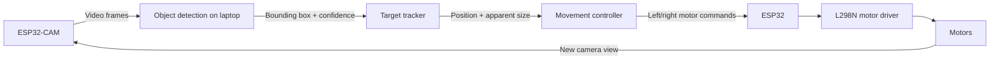
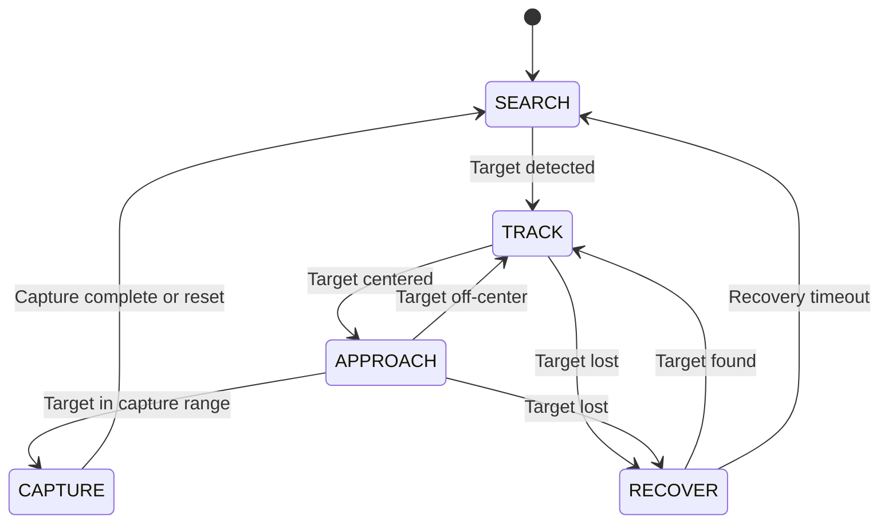
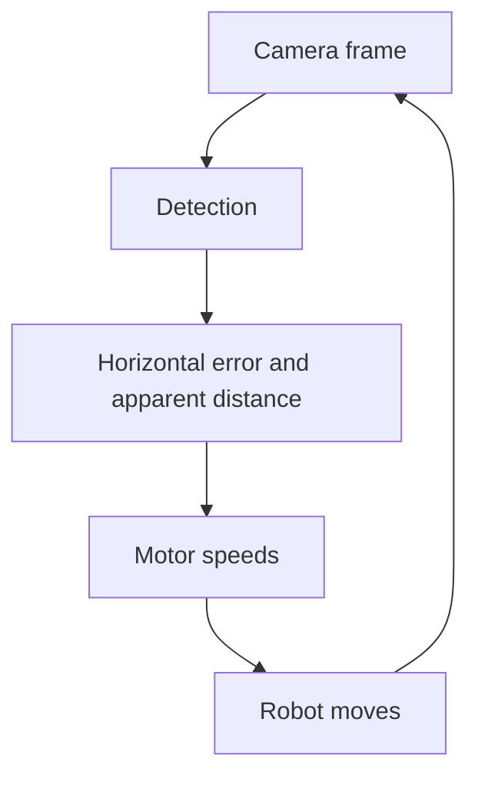

# ROACH HUNTER: Tracking and Movement Algorithm

This document describes the first closed-loop pursuit system for ROACH HUNTER. The initial goal is reliable visual tracking and pursuit; trajectory prediction is deliberately deferred until the core loop works on the real robot.

## System Pipeline



The laptop acts as the vision and control computer for the prototype. It receives frames from the ESP32-CAM, runs detection and control, then sends motor commands to the ESP32. Keeping vision separate from motor control makes each part easier to test and replace.

## 1. Object Detection

The camera continuously streams frames to the laptop. For each frame, the detector identifies the cockroach and returns a detection such as:

```text
class      = cockroach
confidence = 0.92
bbox       = (x1, y1, x2, y2)
```

The tracker derives the values needed by the controller:

```text
roach_x   = (x1 + x2) / 2
roach_y   = (y1 + y2) / 2
bbox_size = (x2 - x1) * (y2 - y1)
```

For the first version, the vision module has one responsibility: report where the target is in the frame. It should also reject detections below a chosen confidence threshold and select one target consistently when multiple detections appear.

## 2. Steering Control

Steering is driven first by the target's horizontal position. Let `camera_center_x` be half of the frame width:

```text
error = roach_x - camera_center_x
```

```text
error < 0  target is left of center   -> turn left
error > 0  target is right of center  -> turn right
error ≈ 0  target is centered         -> drive forward
```

### Threshold Controller (M2)

The simplest working controller divides the frame into left, center, and right regions:

```python
if error < -threshold:
    turn_left()
elif error > threshold:
    turn_right()
else:
    move_forward()
```

This is sufficient for the first integration test: the robot must rotate until the camera faces the target.

### Proportional Controller (M3)

Once turning works, replace fixed turns with proportional steering. Normalize the error so it remains comparable across resolutions:

```python
normalized_error = (roach_x - camera_center_x) / camera_center_x
turn = Kp * normalized_error

left_speed  = base_speed + turn
right_speed = base_speed - turn
```

The sign convention must be verified on the physical drivetrain; swap the `+` and `-` terms if a positive error turns the robot the wrong way. Clamp both commands to the valid PWM range.

With proportional control, a target far to the right produces a stronger right turn, while a target near the center produces only a small correction. This avoids repeated full left/right oscillation and gives smoother pursuit.

## 3. Distance and Obstacle Handling

The ultrasonic sensor should not be the primary cockroach-distance sensor. A cockroach is small, close to the floor, and irregularly shaped, so the sensor may read the floor, wall, or another large object instead.

For the first version, estimate distance from the image:

```text
small bounding box      -> far away       -> move faster
medium bounding box     -> medium range   -> normal speed
large bounding box      -> close          -> slow down
very large bounding box -> capture range  -> stop and capture
```

The target's vertical image position, especially the bottom of its bounding box, may also help estimate ground-plane distance when the camera height and angle are fixed. Exact centimeter-level depth is not required for the initial demo; stable `FAR`, `MEDIUM`, `CLOSE`, and `CAPTURE` ranges are enough.

Use the ultrasonic sensor as a safety sensor instead:

```text
ultrasonic distance < 10 cm
-> stop motors
```

The exact stop threshold should be calibrated on the robot. This prevents collisions while vision remains responsible for target detection and rough range.

## 4. Robot State Machine



### SEARCH

No target is visible. Rotate slowly in place to scan for one.

### TRACK

The target is visible but not centered. Turn using the horizontal error until the camera is aligned with the target.

### APPROACH

The target is approximately centered. Move forward while continuing small steering corrections. Reduce speed as the apparent target size increases.

### CAPTURE

The target has reached the calibrated capture range. Stop the motors, then trigger the capture mechanism.

### RECOVER

When the target is lost from `TRACK` or `APPROACH`, briefly search in the last known direction, then run detection again. If the target is not reacquired within a short timeout, return to `SEARCH`.

## Development Milestones

### M1 — Detection

**Goal:** Detect the cockroach reliably in the camera stream.

**Input:** Camera frame.

**Output:** `bbox`, `confidence`, `center_x`, and `center_y`.

**Success criterion:** When a mock cockroach is moved in view, the bounding box follows it continuously enough for the controller to use.

### M2 — Turn Toward Target

**Goal:** Make the robot face the target autonomously.

**Required behavior:**

```text
target left    -> turn left
target right   -> turn right
target centered -> stop turning
```

**Success criterion:** With the target placed at different positions to the left and right, the robot consistently rotates until its camera points at the target.

This is the first critical integration milestone: detection must create a motor command that changes the next camera frame in the intended direction.

### M3 — Follow / Pursuit

**Goal:** Follow a moving target.



**Controller behavior:**

```text
far + centered -> move forward quickly
far + right    -> move forward while turning right
far + left     -> move forward while turning left
close           -> slow down
```

**Success criterion:** A person can move a mock cockroach across the floor and the robot follows it continuously.

M3 is the core demo: at this point the system is an autonomous visual tracking robot.

### M4 — Lost-Target Recovery

**Goal:** Recover instead of immediately stopping when the target leaves the camera view.

Store the last observed direction. For example:

```text
last_seen_direction = RIGHT
```

Then use the following behavior:

```text
target lost
-> turn toward the last known direction for a short period
-> run detection again
-> target found: TRACK
-> target not found: SEARCH
```

**Success criterion:** When the target briefly exits the frame, the robot has a reasonable chance of reacquiring it without manual reset.

### M5 — Capture

**Goal:** Enter capture mode after approaching close enough.

```text
APPROACH
-> target reaches capture zone
-> stop motors
-> CAPTURE
```

Start with a calibrated image threshold rather than an exact physical-distance estimate:

```text
bbox_size > capture_threshold
-> capture
```

**Success criterion:** The robot can complete `detect -> pursue -> approach -> stop/capture` autonomously.

### M6 — Prediction and Interception (Stretch Goal)

Do this only after M1–M5 work reliably. Rather than steering toward the target's current location every time, estimate where it is moving.

```text
t0: (x0, y0)
t1: (x1, y1)
t2: (x2, y2)
t3: (x3, y3)
```

Use recent tracked positions to estimate direction and velocity, then drive toward a predicted interception point. Later, camera calibration can convert image coordinates into approximate ground-plane coordinates for a more useful prediction.

## Development Priority

```text
M1 Detection
-> M2 Turn Toward Target
-> M3 Follow Target       (core demo)
-> M4 Lost-Target Recovery
-> M5 Capture              (complete demo)
-> M6 Predict / Intercept  (stretch goal)
```

Do not start M6 before the closed loop is working:

> Camera detects a target on the right -> laptop computes a right-turn command -> ESP32 receives it -> the wheels run at different speeds -> the robot turns right -> the target moves closer to the frame center in the next frame.

Once this loop works reliably, the core ROACH HUNTER architecture is established. Prediction and capture become incremental additions rather than separate systems.
